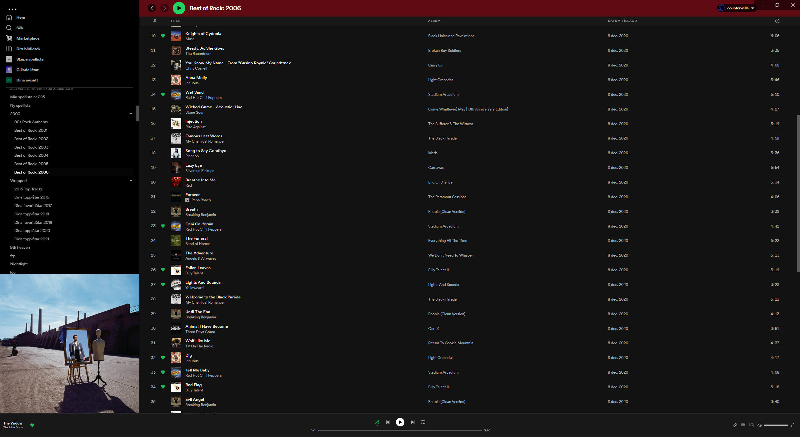
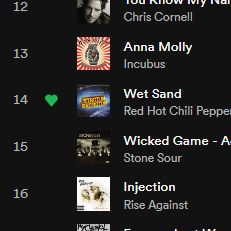

## A Spicetify theme w/ a few fixes for the default spotify theme:

- Full width playlists
- Heart icons to the right of song titles

  

- Bigger cover art (and wider max width of playlist panel)

- Fixed folder arrows (open and close states have correct rotations)

  

- Slight highlight for selected playlist.

  

## Installation

- copy the SpotifyFixes folder to `.spicetify/Themes`
- run `spicetify config current_theme SpotifyFixes`

## or Install via [spicetify marketplace](https://github.com/CharlieS1103/spicetify-marketplace)
